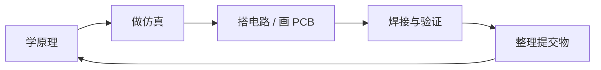

# 六周培训计划

2027 秋季招新第一个月的培训与考核安排。每周一个主题，==前三周偏硬件、后三周偏单片机==，C 语言作为副线贯穿全程。

:::info
这份计划按学习引导设计，不是硬性筛选。收取采用自愿提交方式，鼓励实操。
:::

## 推进节奏

每周都按同一个顺序走，不要跳步：

| 主线         | 怎么推进                                                       |
| ------------ | -------------------------------------------------------------- |
| **硬件主线** | 每周走一遍仿真 → 搭建 → PCB 的路径。先把电路跑通，再落到板子上 |
| **软件主线** | 按 C 语言 → HAL 库 → 外设 → 通信逐步递进，不跳步               |
| **学习方式** | 前半段偏认知与拆解，后半段偏综合设计与焊接验证                 |
| **输出要求** | 文档、截图、照片、演示视频、原理说明都算有效交付               |

## 六周一览

::: timeline 第 1 周 · 9月15日 - 9月21日
**[环境、器件与电学入门](/training/week1)** —— 把"能看懂、能安装、能跑起来"这三件事先做完。
:::

::: timeline 第 2 周 · 9月22日 - 9月28日
**[典型电路、仿真与 PCB](/training/week2)** —— 从"看懂器件"走向"把器件拼成能工作的电路"。
:::

::: timeline 第 3 周 · 9月29日 - 10月5日
**[电源链路与系统设计](/training/week3)** —— 核心是系统思维：输入、充电、转换、保护、接口一起看。
:::

::: timeline 第 4 周 · 10月6日 - 10月12日
**[STM32、焊接与验证](/training/week4)** —— 进入"从原理到实物"的关键阶段。
:::

::: timeline 第 5 周 · 10月13日 - 10月19日
**[最小系统板与外设入门](/training/week5)** —— 从"会用开发板"进到"会做开发板"。
:::

::: timeline 第 6 周 · 10月20日 - 10月26日
**[中断、ADC 与通信整合](/training/week6)** —— 把单项知识拉回工程场景，形成完整演示。
:::

## 三条原则

:::tip 仿真先行
先把原理跑通，再做板子和焊接。这一条在第二、三周最容易被跳过，==代价是打样回来才发现画错==，一轮就是一周。
:::

:::tip 先基础，后综合
电子常识、仿真、PCB、焊接、STM32 依次递进。前面欠的账后面一定会还。
:::

:::tip 以学习引导为主
文档和照片即可交付，鼓励实操记录。做到哪一步就交到哪一步，不要因为"没做完"而不交。
:::

## 相关页面

- [本周该做什么](/schedule) —— 自动定位当前周次和剩余天数
- [环境配置指引](/environment/) —— 第一周的主要工作量
- [物料总清单](/resources/bom) —— 六周采购汇总，可以一次性下单
- [视频入口](/resources/videos) —— 全部六讲的链接
