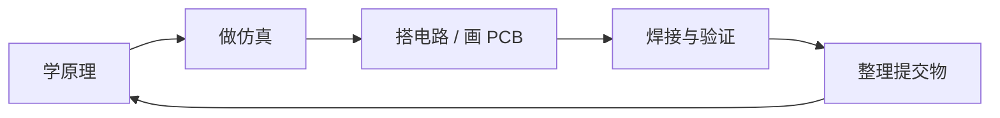

# 培训计划

2027 秋季招新第一个月的培训与考核安排，共七周。每周一个主题，==前段偏硬件、后段偏单片机==，C 语言作为副线贯穿全程。

:::info
这份计划按学习引导设计，不是硬性筛选。收取采用自愿提交方式，鼓励实操。
:::

## 推进节奏

每周都按同一个顺序走，不要跳步：

| 主线         | 怎么推进                                                             |
| ------------ | -------------------------------------------------------------------- |
| **硬件主线** | 从第二周起走一遍仿真 → 搭建 → PCB 的路径。先把电路跑通，再落到板子上 |
| **软件主线** | 按 C 语言 → HAL 库 → 外设 → 通信逐步递进，不跳步                     |
| **学习方式** | 前半段偏认知与拆解，后半段偏综合设计与焊接验证                       |
| **输出要求** | 文档、截图、照片、演示视频、原理说明都算有效交付                     |

周次、日期和当周要点都在 [本周该做什么](/schedule) 里维护，改一处两边同步。

## 三条原则

:::tip 仿真先行
先把原理跑通，再做板子和焊接。这一条在第二、三周最容易被跳过，==代价是打样回来才发现画错==，一轮就是一周。
:::

:::tip 先基础，后综合
电子常识、仿真、PCB、焊接、STM32 依次递进。前面欠的账后面一定会还。
:::

:::tip 以学习引导为主
文档和照片即可交付，鼓励实操记录。做到哪一步就交到哪一步，不要因为"没做完"而不交。
:::

## 相关页面

- [本周该做什么](/schedule) —— 自动定位当前周次和剩余天数
- [第 1 周 · 硬件导论与嘉立创 EDA](/training/week1) —— 重点任务、难点任务与课后自测
- [讲义 · 硬件导论](/training/note1) —— 第一讲的完整讲义，含元器件与 PCB 工艺
- [第 2 周 · 典型电路、仿真与 PCB](/training/week2) —— 运放、三极管与线性稳压器实战
- [讲义 · 原理图与 PCB 综合实战](/training/note2) —— 第二讲的完整讲义，以线性稳压器为模型
- [环境配置指引](/environment/) —— 第一周的主要工作量
- [物料总清单](/resources/bom) —— 七周采购汇总，可以一次性下单
- [视频入口](/resources/videos) —— 全部六讲的链接
