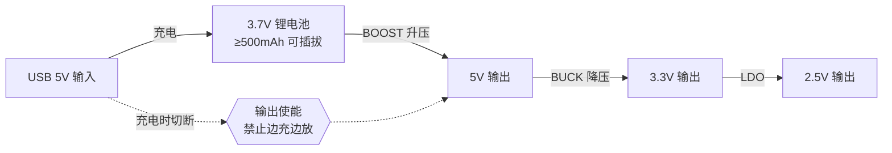

# 第 3 周 · 电源链路与系统设计

**9月29日 - 10月5日 · 对应视频第五讲**

这一周的核心是**系统思维**：输入、充电、转换、保护、接口一起看，而不是单独挑芯片。

## 本周大作业

设计一块电源板，要求如下：

- 输入一节**可插拔**标称 3.7V 锂电池，容量不低于 500mAh
- 可由 USB 5V 充电，考虑焊接难度可用两脚 microUSB
- ==不允许支持边充边放==，充电时输出口不得带有电压
- 实现三路输出，链路关系如下
- 接口可自选，但链路关系要清楚

:::danger 这周的硬约束
"不允许边充边放"和"充电时输出口不得带有电压"是**设计约束，不是建议**。这意味着你需要一个切换或使能机制，而不是把充电芯片输出直接并到负载上。
:::

## 本周任务

- 完成上述电源板设计
- C 语言推进到结构体、联合体，并开始接触堆栈概念

## 任务顺序

1. **先画出完整电源树和充电逻辑**，框图画清楚再动手选芯片
2. 再决定芯片与接口，逐个查数据手册确认输入输出范围和外围元件
3. 最后输出 PCB 截图和原理说明

:::tip
这周的重点是电源系统约束，不是"堆模块"。先画框图，再拆芯片和保护条件。==框图画对了，选型只是查手册==。
:::

## 选型时要确认什么

每颗电源芯片至少确认这几项，写进你的原理说明里：

- 输入电压范围能否覆盖锂电池的 3.0~4.2V 全程
- 输出电流是否够，留多少余量
- 需要什么外围元件（电感值、输入输出电容、反馈电阻）
- 静态电流多大（电池供电时这一项影响待机时间）
- 封装能不能手焊

## 物料准备

**需要采购：** 3.7V 可插拔锂电池（≥500mAh）、microUSB 两脚座或 USB 5V 输入口、充电芯片或充电模块、升压芯片、降压芯片、LDO、电感、电容、电阻、接口座、排针。

**需要准备：** 电源路径框图、各芯片数据手册、万用表、可调电源（若有）、原理分析笔记。

:::warning 锂电池安全
锂电池短路会起火。焊接和调试时电池先不要插上，确认电源链路没有短路再上电。不要把电池长时间留在没有保护板的电路上。
:::

## 提交建议

- PCB 截图
- 原理解释报告（==要能解释清楚为什么这么选==，不只是贴图）

## 视频入口

- [第五讲：必备硬件知识](https://www.bilibili.com/video/BV1XzHczcEVy/)

## 参考资料

- [TI 电池管理](https://www.ti.com/power-management/battery-management/overview.html)
- [TI DC-DC 转换器](https://www.ti.com/power-management/dcdc-converters/overview.html)
- [TI LDO 线性稳压器](https://www.ti.com/power-management/linear-regulators-ldo/overview.html)
