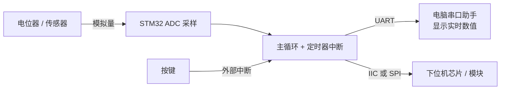

# 第 6 周 · 中断、ADC 与通信整合

**10月20日 - 10月26日 · 收束与综合**

这一周是把单项知识拉回工程场景，形成完整演示。

## 本周任务

- 学习 STM32 开发中的中断、ADC 等知识
- 巩固有线通信协议
- 尝试实现单片机与下位机芯片，以及与电脑通信

:::tip
这一周的重点是把"外设能用"变成 ==系统能通信、能采样、能解释==。单个外设跑通不算完成，要能串成一条链路。
:::

## 任务顺序

1. 先做中断和 ADC 的基础实验
2. 再接回前面学过的通信协议
3. 最后完成通信演示和视频记录

## 一个可以照着做的综合演示

如果不知道做什么，可以按这个来：

做完能回答这几个问题，这一周就算过了：

- 定时器中断的周期是怎么算出来的？和时钟树哪一段有关？
- ADC 采样值怎么换算回实际电压？参考电压是多少？
- 按键为什么要消抖？你用的是硬件消抖还是软件消抖？
- 串口波特率两边不一致会看到什么现象？

## 中断要注意的

:::warning
中断服务函数（ISR）里==不要做耗时操作==，也不要用 `printf`。常见做法是在 ISR 里只置一个标志位或写一次缓冲区，实际处理放回主循环。
:::

## 物料准备

**需要采购：** 电位器或模拟传感器、USB 转串口模块、上位机通信线、杜邦线、待联调的下位机模块、ADC 输入源或可调电压源。

**需要准备：** 串口调试助手、示波器或逻辑分析仪（有则更好）、前几周完成的板子、固件工程和测试记录。

## 提交建议

- STM32 演示视频

## 视频入口

- [第六讲：最小系统板绘制与大作业指导](https://www.bilibili.com/video/BV1vtHJzHEKK/)
- [第五讲：必备硬件知识](https://www.bilibili.com/video/BV1XzHczcEVy/)

## 参考资料

- [STM32Cube MCU Packages](https://www.st.com/en/embedded-software/stm32cube-mcu-packages.html)
- [STM32F103C8 产品页](https://www.st.com/en/microcontrollers-microprocessors/stm32f103c8.html)
- [STM32CubeIDE](https://www.st.com/en/development-tools/stm32cubeide.html)

---

## 培训结束之后

第一个月的内容到这里结束。接下来通常会：

- 分配到具体的车组，跟着老队员做实际项目
- 接触 RM 官方的 ==C 板（STM32F407IGH6）== 和达妙 MC02（STM32H723VGT6），比 F103 复杂不少
- 开始接触电机驱动、裁判系统接口这类车上真正要用的东西

<ToDo>这一节等硬件组补充"进组之后做什么"的具体安排。</ToDo>
